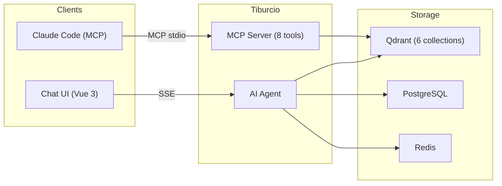
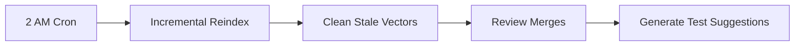

<h1 align="center">Tiburcio</h1>

<p align="center">
  <strong>Developer intelligence layer for Claude Code.</strong><br/>
  <em>Makes your AI coding assistant actually understand your codebase, conventions, and what changed overnight.</em>
</p>

<p align="center">
  <a href="https://github.com/JoaoMorais03/tiburcio/actions/workflows/ci.yml"></a>
  <a href="docs/CHANGELOG.md"></a>
  <a href="LICENSE"></a>
  <a href="https://www.typescriptlang.org/"></a>
  <a href="https://nodejs.org/"></a>
</p>

<p align="center">
  <a href="#quick-start">Quick Start</a> &middot;
  <a href="#mcp-tools">MCP Tools</a> &middot;
  <a href="#how-it-works">How It Works</a> &middot;
  <a href="#configuration">Configuration</a> &middot;
  <a href="docs/CONTRIBUTING.md">Contributing</a>
</p>

---

Tiburcio is an MCP server that gives Claude Code deep context about your codebase. It indexes your standards, architecture docs, source code, and DB schemas into a vector database — then exposes 8 specialized tools that return focused, token-efficient answers. Every night it reviews yesterday's merges against your team's conventions and generates test suggestions.

**The result**: Claude Code stops guessing and starts answering from your actual codebase.

---

## The Problem

Claude Code is powerful but generic. It doesn't know:
- Your team's coding conventions
- Your system architecture and how components connect
- What changed in the codebase yesterday
- Which merges broke your team's standards
- How your team actually writes tests

Developers end up repeating context in every prompt, or Claude Code produces code that doesn't match team conventions.

## The Solution

Tiburcio bridges this gap by acting as a **codebase intelligence layer** between Claude Code and your team's knowledge:

- **8 MCP tools** that return compact, focused answers (300-1,500 tokens per call, not 8,000)
- **Nightly intelligence** — reviews merges against conventions, generates test scaffolds, flags critical issues
- **Morning briefings** — "here's what changed overnight, here are the problems"
- **Convention enforcement** — Claude Code checks standards before writing code
- **Always grounded** — every answer comes from your actual docs and code, never hallucinated

---

## How It Works



### Day Mode — Intelligence on Demand

Claude Code calls MCP tools as needed. Each tool returns a focused, token-efficient response:

```
Developer: "Write a new API endpoint for user preferences"

Claude Code (via MCP):
1. searchStandards → team's endpoint conventions (compact: 3 results, ~400 tokens)
2. getPattern → "new-api-endpoint" template (~600 tokens)
3. searchCode → existing similar endpoints (~500 tokens)

→ Writes code that matches YOUR conventions, YOUR patterns, YOUR architecture.
```

### Night Mode — Overnight Intelligence



1. **Re-indexes** files that changed since the last run
2. **Cleans up** stale vectors for deleted/modified files
3. **Reviews** yesterday's merges against team conventions — flags bugs, security issues, and standards violations
4. **Generates test suggestions** grounded in how your team actually writes tests

### Morning Briefing

```
Developer: "What should I know this morning?"

Claude Code (via MCP):
1. getNightlySummary → "3 merges reviewed, 1 CRITICAL issue in PaymentService,
   2 warnings, 2 files need tests"

→ Developer knows exactly what needs attention before writing a single line of code.
```

---

## Quick Start

### Prerequisites

- [Node.js](https://nodejs.org/) 22+ and [pnpm](https://pnpm.io/) 10+
- [Docker](https://www.docker.com/) and Docker Compose
- One of:
  - [OpenRouter](https://openrouter.ai/) API key (cloud inference)
  - [Ollama](https://ollama.ai/) (local inference, zero API calls)

### Option A: Cloud Models (OpenRouter)

```bash
git clone https://github.com/JoaoMorais03/tiburcio.git
cd tiburcio
cp .env.example .env
# Edit .env — set OPENROUTER_API_KEY
docker compose up -d
```

### Option B: Local Models (Ollama)

```bash
git clone https://github.com/JoaoMorais03/tiburcio.git
cd tiburcio
cp .env.example .env
# Edit .env — set MODEL_PROVIDER=ollama (no API key needed)
docker compose --profile ollama up -d
# Pull models (first time only):
docker exec ollama ollama pull qwen3:8b
docker exec ollama ollama pull nomic-embed-text
```

Wait for all services to become healthy (`docker compose ps`), then open **http://localhost:5174** for the chat UI. Database migrations run automatically on first boot.

### Connect Claude Code

**Option 1: Local (stdio) — for solo development:**

```bash
cd backend
claude mcp add tiburcio -- npx tsx src/mcp.ts
```

**Option 2: HTTP/SSE — for shared team deployment:**

Set `TEAM_API_KEY` in your `.env`, then each developer connects:

```bash
claude mcp add tiburcio \
  --transport sse \
  --url http://your-server:3000/mcp/sse \
  --header "Authorization:Bearer <team-api-key>"
```

Claude Code now has 8 specialized tools. Ask it anything about your codebase.

### Development Mode

```bash
pnpm install
docker compose up db redis qdrant -d
cp .env.example .env              # configure your model provider
cd backend && pnpm db:migrate     # run database migrations
cd .. && pnpm dev                 # backend + frontend dev servers
```

---

## MCP Tools

8 tools, each designed to return focused answers (compact mode by default):

| Tool | What It Does | Key Filters |
|------|-------------|-------------|
| `searchStandards` | Team coding conventions and best practices | `category`: backend, frontend, database, integration |
| `searchCode` | Source code by semantic meaning (hybrid search) | `language`: java, ts, vue, sql · `layer`: 20-value enum · `repo` |
| `getArchitecture` | System architecture and component flows | `area`: auth, requests, batch, notifications, ... |
| `searchSchemas` | Database table documentation and relationships | `tableName` |
| `searchReviews` | Nightly code review insights and issues | `severity`: info, warning, critical · `category` |
| `getTestSuggestions` | AI-generated test scaffolds from nightly analysis | `language`: java, typescript, vue |
| `getPattern` | Code templates (list or get by name) | `name` |
| `getNightlySummary` | Morning briefing — merges, issues, test gaps | `daysBack` |

### Token Efficiency

Every tool defaults to **compact mode** — minimal, focused responses optimized for Claude Code's context window:

| Mode | Tokens/Call | Results | Use Case |
|------|-----------|---------|----------|
| Compact (default) | 300-1,500 | 3 results, summaries only | MCP tool calls, quick lookups |
| Full (`compact: false`) | 2,000-8,000 | 5-8 results, complete content | Deep dives, detailed analysis |

### Design Principles

- **Compass, not encyclopedia** — point Claude Code to the right answer, don't dump the entire doc
- **Recovery guidance** — every empty result suggests alternative tools or search terms
- **MCP annotations** — all tools declare `readOnlyHint: true` + `openWorldHint: false`
- **Hybrid search** — dense vectors (cosine) + BM25 sparse vectors with RRF fusion on code-chunks
- **Payload truncation** — large fields capped to reduce token overhead

---

## Add Your Knowledge Base

Replace the contents of `standards/` with your team's documentation:

```
standards/
  architecture/    # System design docs (auth flows, data pipelines, etc.)
  backend/         # Backend coding conventions
  frontend/        # Frontend conventions
  database/
    schemas/       # Table-by-table documentation
  patterns/        # Code templates ("new API endpoint", "new Vue page")
  integration/     # Git workflow, CI/CD, deployment docs
```

Then reindex:

```bash
# Via admin API (login first via the UI for httpOnly cookie auth)
curl -X POST http://localhost:5174/api/admin/reindex --cookie "token=$TOKEN"

# Or via CLI
cd backend
pnpm index:standards
pnpm index:codebase        # set CODEBASE_REPOS in .env first
pnpm index:architecture
```

---

## Architecture

### Tech Stack

| Layer | Technology |
|-------|-----------|
| **MCP Server** | [@mastra/mcp](https://mastra.ai/docs/mcp) (stdio + HTTP/SSE transport, 8 tools) |
| **Agent** | [Mastra](https://mastra.ai) AI framework |
| **LLM** | OpenRouter (MiniMax M2.5) or Ollama (Qwen3 8B) — provider-agnostic |
| **Embeddings** | OpenRouter (`qwen/qwen3-embedding-8b`, 4096 dims) or Ollama (`nomic-embed-text`, 768 dims) |
| **Ranking** | Qdrant RRF fusion (dense + BM25 reciprocal rank fusion) |
| **Vector DB** | [Qdrant](https://qdrant.tech) — 6 collections, cosine similarity |
| **Backend** | [Hono](https://hono.dev) + Node.js 22 |
| **Frontend** | [Vue 3](https://vuejs.org) + Vite + Tailwind CSS v4 |
| **Database** | PostgreSQL 17 + [Drizzle ORM](https://orm.drizzle.team) |
| **Auth** | httpOnly cookie JWT (HS256) + refresh token rotation + bcrypt |
| **Jobs** | [BullMQ](https://docs.bullmq.io) + Redis (nightly cron) |
| **Observability** | [Langfuse](https://langfuse.com) (self-hosted, optional) |
| **Testing** | [Vitest](https://vitest.dev) — 166 tests (136 backend + 30 frontend) |

### Qdrant Collections

| Collection | What's Indexed | Search Type |
|-----------|----------------|-------------|
| `standards` | Team conventions, best practices | Dense |
| `code-chunks` | Source code (AST chunking via tree-sitter) | Hybrid (dense + BM25 RRF) |
| `architecture` | System architecture docs | Dense |
| `schemas` | Database table documentation | Dense |
| `reviews` | Nightly code review insights | Dense |
| `test-suggestions` | AI-generated test scaffolds | Dense |

### Services

| Service | Port | Purpose |
|---------|------|---------|
| Frontend | 5174 | Chat UI (nginx, proxies `/api` to backend) |
| Backend | 3333 | API + Agent + MCP tools |
| PostgreSQL | 5555 | Users, conversations, messages |
| Qdrant | 6333 | Vector search + dashboard |
| Redis | 6379 | Rate limiting + job queues |
| Langfuse | 3001 | LLM observability (optional) |
| Ollama | 11434 | Local inference (optional, `--profile ollama`) |

### Project Structure

```
tiburcio/
  backend/
    src/
      config/          # Environment, logger, Redis client
      db/              # Drizzle schema, connection, migrations
      indexer/         # Code chunker, embedding, indexing pipelines
      jobs/            # BullMQ background jobs + nightly cron
      mastra/
        agents/        # Chat agent + code review agent
        tools/         # 8 RAG tools (Qdrant vector search)
        workflows/     # Nightly review workflow
        infra.ts       # Shared singletons (qdrant, models, clients)
      middleware/       # Rate limiters (global, auth, chat)
      routes/          # HTTP routes (auth, chat, admin, MCP SSE)
      mcp.ts           # MCP stdio server for local Claude Code
      server.ts        # HTTP server entry point
    scripts/           # CLI indexing scripts
  frontend/
    src/
      components/      # UI primitives + chat components
      lib/             # API client, Vue Query, web vitals
      stores/          # Pinia stores (auth, chat, rate-limit)
      views/           # Page components (Auth, Chat)
  standards/           # Your team's knowledge base (docs go here)
  docs/                # Changelog, contributing guide, roadmap
```

---

## Configuration

All configuration via environment variables. See [`.env.example`](.env.example) for the full list.

### Model Provider

| Variable | Required | Default | Description |
|----------|----------|---------|-------------|
| `MODEL_PROVIDER` | No | `openrouter` | `openrouter` (cloud) or `ollama` (local) |

### OpenRouter (cloud)

| Variable | Required | Default | Description |
|----------|----------|---------|-------------|
| `OPENROUTER_API_KEY` | Yes (if openrouter) | — | API key from openrouter.ai |
| `OPENROUTER_MODEL` | No | `minimax/minimax-m2.5` | Chat model ID |
| `EMBEDDING_MODEL` | No | `qwen/qwen3-embedding-8b` | Embedding model ID |
| `EMBEDDING_PROVIDER` | No | `nebius` | Embedding provider on OpenRouter |

### Ollama (local)

| Variable | Required | Default | Description |
|----------|----------|---------|-------------|
| `OLLAMA_BASE_URL` | No | `http://ollama:11434` | Ollama server URL |
| `OLLAMA_CHAT_MODEL` | No | `qwen3:8b` | Ollama chat model |
| `OLLAMA_EMBEDDING_MODEL` | No | `nomic-embed-text` | Ollama embedding model |
| `EMBEDDING_DIMENSIONS` | No | Auto-detected | 768 (Ollama) or 4096 (OpenRouter) |

### Infrastructure

| Variable | Required | Default | Description |
|----------|----------|---------|-------------|
| `DATABASE_URL` | **Yes** | — | PostgreSQL connection string |
| `JWT_SECRET` | **Yes** | — | Min 32 chars (`openssl rand -base64 32`) |
| `REDIS_URL` | No | `redis://localhost:6379` | Redis connection string |
| `QDRANT_URL` | No | `http://localhost:6333` | Qdrant server URL |
| `PORT` | No | `3000` | Backend server port |
| `NODE_ENV` | No | `development` | Environment mode |
| `CORS_ORIGINS` | No | `localhost:5173,5174` | Comma-separated allowed origins |

### MCP HTTP/SSE Transport

| Variable | Required | Default | Description |
|----------|----------|---------|-------------|
| `TEAM_API_KEY` | For HTTP MCP | — | Bearer token for MCP SSE auth (`openssl rand -base64 32`) |

### Codebase Indexing

| Variable | Required | Default | Description |
|----------|----------|---------|-------------|
| `CODEBASE_HOST_PATH` | No | — | Host path to project root (Docker volume mount) |
| `CODEBASE_REPOS` | No | — | Repos to index: `name:path:branch` (comma-separated) |

### Observability

| Variable | Required | Default | Description |
|----------|----------|---------|-------------|
| `LANGFUSE_PUBLIC_KEY` | No | — | Langfuse public key |
| `LANGFUSE_SECRET_KEY` | No | — | Langfuse secret key |
| `LANGFUSE_BASE_URL` | No | `http://langfuse:3000` | Langfuse server URL |

### Default Credentials

| Service | URL | Login | Password |
|---------|-----|-------|----------|
| Langfuse | http://localhost:3001 | `admin@tiburcio.local` | `admin123` |
| Qdrant | http://localhost:6333/dashboard | No auth | — |

---

## Testing

```bash
cd backend && pnpm test    # 136 tests
cd frontend && pnpm test   # 30 tests
cd backend && pnpm check   # biome lint + tsc
cd frontend && pnpm check  # biome lint + vue-tsc
```

All tests run with mocks — no external services needed.

---

## Roadmap

See [`docs/V2_PLAN.md`](docs/V2_PLAN.md) for the active roadmap:

- **Event-Driven Freshness** — webhook-triggered indexing, <10 min freshness guarantee
- **MCP HTTP/SSE Transport** — shared team deployment, one pod for the whole team
- **Convention Guardian** — convention scoring, drift tracking, weekly reports
- **Nightly Intelligence Enhancements** — change summaries, convention drift reports

---

## Claude Code Setup

This project includes a [`CLAUDE.md`](CLAUDE.md) configuration file that gives Claude Code full context about the architecture, commands, patterns, and gotchas. Clone the repo and Claude is ready to work.

For MCP integration:

```bash
cd backend
claude mcp add tiburcio -- npx tsx src/mcp.ts
```

---

## Contributing

See [CONTRIBUTING.md](docs/CONTRIBUTING.md) for development setup and PR process.

## License

[MIT](LICENSE)
