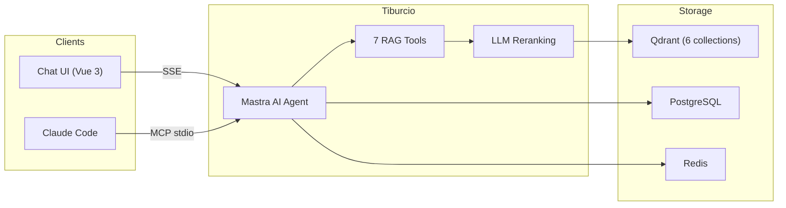
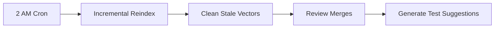

<h1 align="center">Tiburcio</h1>

<p align="center">
  <strong>The onboarding agent that learns your codebase overnight.</strong>
</p>

<p align="center">
  <a href="https://github.com/JoaoMorais03/tiburcio/actions/workflows/ci.yml"></a>
  <a href="docs/CHANGELOG.md"></a>
  <a href="LICENSE"></a>
  <a href="https://www.typescriptlang.org/"></a>
  <a href="https://nodejs.org/"></a>
</p>

<p align="center">
  <a href="#quick-start">Quick Start</a> &middot;
  <a href="#mcp-server">MCP Server</a> &middot;
  <a href="#how-it-works">How It Works</a> &middot;
  <a href="#configuration">Configuration</a> &middot;
  <a href="docs/CONTRIBUTING.md">Contributing</a>
</p>

---

Tiburcio indexes your docs, standards, and source code into a vector database — then answers developer questions grounded in your actual codebase. Every night it re-indexes what changed, reviews yesterday's merges against your team's conventions, and generates test suggestions.

Works as a **web chat UI** for onboarding conversations and as an **MCP server** so Claude Code can query the same knowledge while you code.

---

## Why?

Every team has the same problem: tribal knowledge lives in people's heads, in Slack threads, in docs that nobody updates. New developers join and ask the same questions. Senior developers become bottlenecks.

Tiburcio fixes this by creating a **living knowledge base** that:

- **Indexes your codebase** — standards, architecture docs, source code, DB schemas
- **Answers questions with citations** — *"According to your auth-flow.md, the JWT token..."*
- **Stays fresh automatically** — nightly re-indexing of code merged to develop
- **Reviews changes against your conventions** — knows when yesterday's merge broke a team standard
- **Suggests tests for new code** — grounded in how your team actually writes tests

The result: a new developer asks *"how do we handle errors in this codebase?"* and gets an answer pulled from your actual conventions doc and real code examples — not a hallucination.

---

## How It Works



### Day Mode — Answer Questions

A developer asks a question via the chat UI or Claude Code. The AI agent picks the right RAG tool, queries Qdrant vectors, reranks results with LLM-based semantic scoring, and returns an answer grounded in your actual documentation and code.

### Night Mode — Learn What Changed



1. **Re-indexes** files that changed since the last run (incremental, not full rebuild)
2. **Cleans up** stale vectors for deleted/modified files
3. **Reviews** yesterday's merges against your team's conventions
4. **Generates test suggestions** for new/changed code

---

## Quick Start

### Prerequisites

- [Node.js](https://nodejs.org/) 22+ and [pnpm](https://pnpm.io/) 10+
- [Docker](https://www.docker.com/) and Docker Compose
- An [OpenRouter](https://openrouter.ai/) API key

### Run

```bash
git clone https://github.com/JoaoMorais03/tiburcio.git
cd tiburcio
cp .env.example .env
# Edit .env — set OPENROUTER_API_KEY (get one at https://openrouter.ai)
docker compose up -d
```

Wait for all services to become healthy (`docker compose ps`), then open **http://localhost:5174**. Database migrations run automatically on first boot.

Register a user and start chatting. On first boot, Tiburcio auto-indexes the bundled standards and architecture docs. If `CODEBASE_REPOS` is set, it also queues a full codebase index.

### Development Mode

```bash
pnpm install
docker compose up db redis qdrant -d
cp .env.example .env              # set OPENROUTER_API_KEY
cd backend && pnpm db:migrate     # run database migrations
cd .. && pnpm dev                 # backend + frontend dev servers
```

---

## MCP Server

Give Claude Code access to your indexed knowledge:

```bash
cd backend
claude mcp add tiburcio -- npx tsx src/mcp.ts
```

Claude Code now has 7 specialized tools:

| Tool | What It Searches | Key Filters |
|------|-----------------|-------------|
| `searchStandards` | Coding conventions, best practices | `category`: backend, frontend, database, integration |
| `searchCode` | Indexed source code by semantic meaning | `language`: java, ts, vue, sql · `layer`: 20-value enum |
| `getArchitecture` | System architecture documentation | `area`: auth, requests, batch, notifications, ... |
| `searchSchemas` | Database table documentation | `tableName` |
| `searchReviews` | Nightly code review insights | `severity`: info, warning, critical · `category` |
| `getTestSuggestions` | AI-generated test scaffolds | `language`: java, typescript, vue |
| `getPattern` | Code templates (list or get by name) | `name` |

Every tool uses **LLM-based reranking** with 2x over-fetch for high-quality results, **strict enum inputs** to prevent empty results from typos, and **recovery guidance** when no results are found (suggests alternative tools).

### Example: Morning Workflow

```
You: "Let's develop tests for yesterday's merges to develop"

Claude Code (via MCP):
1. searchReviews → finds 3 merges: auth refactor, payment endpoint, user validation
2. getTestSuggestions → gets test scaffolds grounded in your Vitest patterns
3. searchCode → finds existing test files for similar modules
4. searchStandards → checks your testing conventions

→ Writes test files grounded in YOUR conventions, YOUR patterns, YOUR code.
```

---

## Add Your Knowledge Base

Replace the contents of `standards/` with your team's documentation:

```
standards/
  architecture/    # System design docs (auth flows, data pipelines, etc.)
  backend/         # Backend coding conventions
  frontend/        # Frontend conventions
  database/
    schemas/       # Table-by-table documentation
  patterns/        # Code templates ("new API endpoint", "new Vue page")
  integration/     # Git workflow, CI/CD, deployment docs
```

Then reindex:

```bash
# Via admin API (login first via the UI for httpOnly cookie auth)
curl -X POST http://localhost:5174/api/admin/reindex --cookie "token=$TOKEN"

# Or via CLI
cd backend
pnpm index:standards
pnpm index:codebase        # set CODEBASE_REPOS in .env first
pnpm index:architecture
```

---

## Architecture

### Tech Stack

| Layer | Technology |
|-------|-----------|
| **Agent** | [Mastra](https://mastra.ai) + MiniMax M2.5 via [OpenRouter](https://openrouter.ai) |
| **Embeddings** | `qwen/qwen3-embedding-8b` via OpenRouter (4096 dims, MTEB Code 80.68) |
| **Reranking** | Mastra `rerank()` — LLM-based semantic scoring on all RAG tools |
| **Vector DB** | [Qdrant](https://qdrant.tech) — 6 collections, cosine similarity |
| **Backend** | [Hono](https://hono.dev) + Node.js 22 |
| **Frontend** | [Vue 3](https://vuejs.org) + Vite + Tailwind CSS v4 |
| **Database** | PostgreSQL 17 + [Drizzle ORM](https://orm.drizzle.team) |
| **Auth** | httpOnly cookie JWT (HS256) + refresh token rotation + bcrypt |
| **Sanitization** | [DOMPurify](https://github.com/cure53/DOMPurify) on all rendered markdown |
| **Jobs** | [BullMQ](https://docs.bullmq.io) + Redis |
| **Observability** | [Langfuse](https://langfuse.com) (self-hosted) |
| **MCP** | [@mastra/mcp](https://mastra.ai/docs/mcp) (stdio transport) |
| **Testing** | [Vitest](https://vitest.dev) — 143 tests (113 backend + 30 frontend) |

### Qdrant Collections

All 4096-dimensional vectors via `qwen/qwen3-embedding-8b`.

| Collection | What's Indexed |
|-----------|----------------|
| `standards` | Team conventions, best practices |
| `code-chunks` | Source code — AST chunking (tree-sitter) + hybrid search (dense + BM25 RRF) |
| `architecture` | System architecture docs |
| `schemas` | Database table documentation |
| `reviews` | Nightly code review insights |
| `test-suggestions` | AI-generated test scaffolds |

### Services

| Service | Port | Purpose |
|---------|------|---------|
| Frontend | 5174 | Chat UI (nginx, proxies `/api` to backend) |
| Backend | 3333 | API + Agent + MCP tools |
| PostgreSQL | 5555 | Users, conversations, messages |
| Qdrant | 6333 | Vector search + dashboard |
| Redis | 6379 | Rate limiting + job queues |
| Langfuse | 3001 | LLM observability |

### Project Structure

```
tiburcio/
  backend/
    src/
      config/          # Environment, logger, Redis client
      db/              # Drizzle schema, connection, migrations
      indexer/         # Code chunker, embedding, reranking, indexing pipelines
      jobs/            # BullMQ background jobs + nightly cron
      mastra/
        agents/        # Chat agent + code review agent
        tools/         # 7 RAG tools (Qdrant vector search)
        workflows/     # Nightly review workflow
        infra.ts       # Shared singletons (qdrant, openrouter)
      middleware/       # Rate limiters (global, auth, chat)
      routes/          # HTTP routes (auth, chat, admin)
      mcp.ts           # MCP stdio server for Claude Code
      server.ts        # HTTP server entry point
    scripts/           # CLI indexing scripts
  frontend/
    src/
      components/      # UI primitives + chat components
      lib/             # API client, Vue Query, web vitals
      stores/          # Pinia stores (auth, chat, rate-limit)
      views/           # Page components (Auth, Chat)
  standards/           # Your team's knowledge base (docs go here)
  docs/                # Changelog, contributing guide, roadmap
```

---

## Configuration

All configuration via environment variables. See [`.env.example`](.env.example) for the full list.

| Variable | Required | Default | Description |
|----------|----------|---------|-------------|
| `OPENROUTER_API_KEY` | **Yes** | — | API key for LLM and embeddings |
| `DATABASE_URL` | **Yes** | — | PostgreSQL connection string |
| `JWT_SECRET` | **Yes** | — | Min 32 chars (`openssl rand -base64 32`) |
| `OPENROUTER_MODEL` | No | `minimax/minimax-m2.5` | Chat model ID |
| `EMBEDDING_MODEL` | No | `qwen/qwen3-embedding-8b` | Embedding model ID |
| `EMBEDDING_PROVIDER` | No | `nebius` | Embedding provider on OpenRouter |
| `REDIS_URL` | No | `redis://localhost:6379` | Redis connection string |
| `QDRANT_URL` | No | `http://localhost:6333` | Qdrant server URL |
| `CODEBASE_HOST_PATH` | No | — | Host path to project root (mounted as `/codebase` in container) |
| `CODEBASE_REPOS` | No | — | Repos to index. Format: `name:path:branch` (comma-separated for multi-repo) |
| `PORT` | No | `3000` | Backend server port |
| `NODE_ENV` | No | `development` | Environment (`development` or `production`) |
| `CORS_ORIGINS` | No | `localhost:5173,5174` | Comma-separated allowed origins |
| `LANGFUSE_PUBLIC_KEY` | No | — | Langfuse observability public key |
| `LANGFUSE_SECRET_KEY` | No | — | Langfuse observability secret key |
| `LANGFUSE_BASE_URL` | No | `http://langfuse:3000` | Langfuse server URL |

### Default Credentials

| Service | URL | Login | Password |
|---------|-----|-------|----------|
| Langfuse | http://localhost:3001 | `admin@tiburcio.local` | `admin123` |
| Qdrant | http://localhost:6333/dashboard | No auth | — |

---

## Testing

```bash
cd backend && pnpm test    # 113 tests
cd frontend && pnpm test   # 30 tests
cd backend && pnpm check   # biome lint + tsc
cd frontend && pnpm check  # biome lint + vue-tsc
```

All tests run with mocks — no external services needed.

---

## Roadmap

See [`docs/FUTURE_IMPROVEMENTS.md`](docs/FUTURE_IMPROVEMENTS.md) for the full plan:

- **Onboarding Intelligence** — learning paths, "what did I miss?" summaries, knowledge gap detection
- **Convention Guardian** — adherence scoring, drift reports, optional PR integration
- **Remote Codebase** — git clone support, HTTP MCP transport
- **Error Tracking** — self-hosted Bugsink integration

---

## Claude Code Setup

This project includes a [`CLAUDE.md`](CLAUDE.md) configuration file that gives Claude Code full context about the architecture, commands, patterns, and gotchas. Clone the repo and Claude is ready to work.

For MCP integration:

```bash
cd backend
claude mcp add tiburcio -- npx tsx src/mcp.ts
```

---

## Contributing

See [CONTRIBUTING.md](docs/CONTRIBUTING.md) for development setup and PR process.

## License

[MIT](LICENSE)
